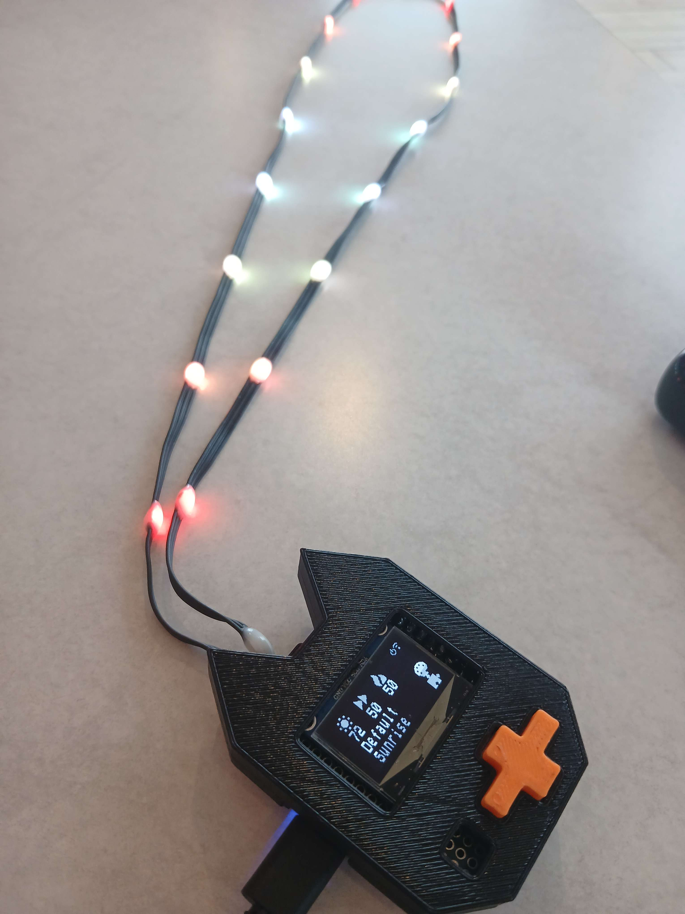

# **Wled on a S2 mini**: A light show in your back pocket!

## Resources:
- [Wled Website](https://kno.wled.ge/)
- [Online Custom Compiler](https://wled-compile.github.io/?lang=en)
- [Usb Nugget](https://github.com/DevKitty-io/USB-Nugget)

## How to Update your S2:
1.	Download the binary file here:

	[S2](https://github.com/Meapy011/ESP32-S2-Wled/raw/refs/heads/main/bins/Wled-15-SR-LCD.bin)

	[Usb Nugget](https://github.com/Meapy011/ESP32-S2-Wled/raw/refs/heads/main/bins/Nugget-Wled15-SR.bin)
2.	Place the S2 in Device Firmware Upgrade (DFU) mode by holding down the 0 button.
4.	Open the [web flasher tool](https://esptool.spacehuhn.com/) in Google Chrome (other browsers not currently supported)
5.	Click on "Connect" and then select the "ESP32-S2" board. Click "Erase" and "OK" to continue.
6.	Once you see "Finished", click "Choose a file" and select the .BIN file you downloaded in step one, with the start value set to 0x0. Then click "Program" to flash!
7.	When its done, unplug the ESP and Reconnect to run your new firmware

## Accessing the Web Interface:

To access the web interface, connect to `Wled-AP` with the password `wled1234`.  In a web browser, navigate to `4.3.2.1`,
if using the nugget variant connect to `Nugget-AP` with the password `nugget1223`.

## Included Usermods:

- Audio Reactive
	- [Read Me](https://github.com/wled/WLED/blob/main/usermods/audioreactive/readme.md)

- Four line display

## Refrence Links
- [Initial Findings on Running Wled on S2](https://github.com/Babyyoda777/WLED-ESP32S2-Mini-Project)
- [Info on dumping ESP32 Flash](https://www.pleasedontcode.com/blog/how-to-extract-a-binary-file-from-esp32-in-simple-words)
- [Info on merging seperate binaries into one](https://georgik.rocks/how-to-build-single-flashable-binary-for-esp32-with-esptool-py/)
- [Troubleshooting Dumping issues with S2](https://www.reddit.com/r/esp32/comments/1bldmd2/comment/kwsvcg2)
